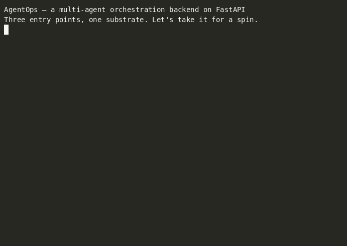
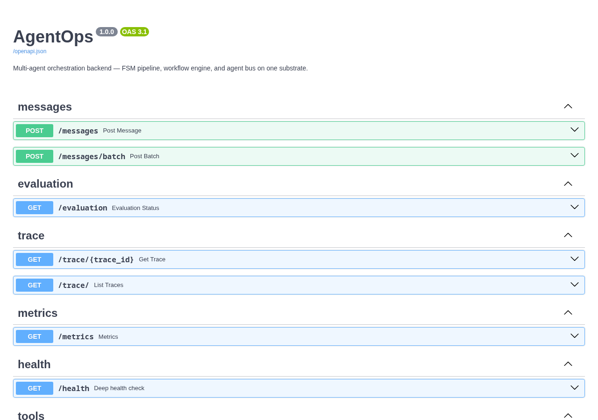
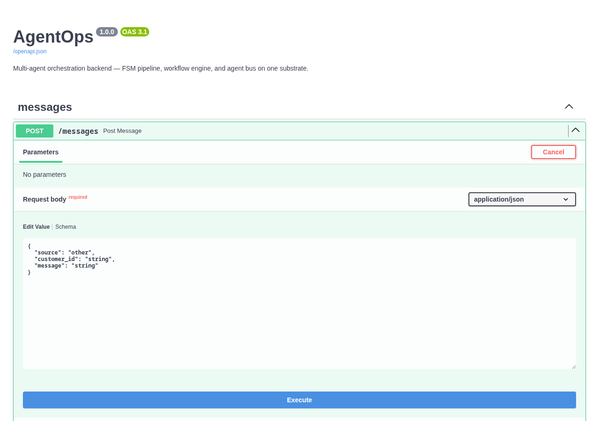
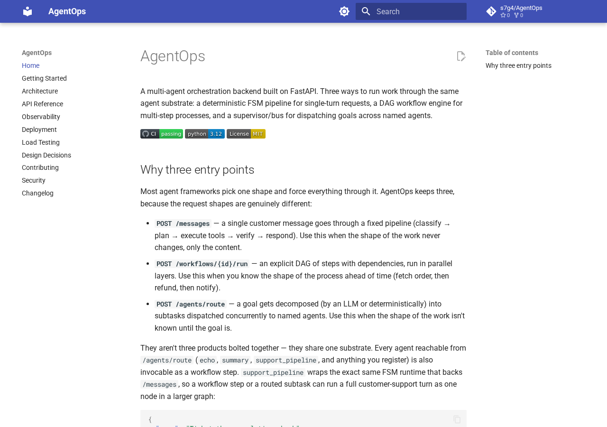

# AgentOps

A multi-agent orchestration backend built on FastAPI. Three ways to run work through the same agent substrate: a deterministic FSM pipeline for single-turn requests, a DAG workflow engine for multi-step processes, and a supervisor/bus for dispatching goals across named agents.

[](https://github.com/s7g4/AgentOps/actions/workflows/ci.yml)
[](https://www.python.org/downloads/release/python-3120/)
[](LICENSE)
[](https://s7g4.github.io/AgentOps/)
[](https://pypi.org/project/s7g4-agentops/)

**[Read the full docs →](https://s7g4.github.io/AgentOps/)**

---

## Demo

All three entry points, an execution trace, and Prometheus metrics — one Docker Compose stack, no external services:



Interactive API docs (Swagger UI, generated from the code, always current) and the full docs site:

<table>
<tr>
<td width="50%"></td>
<td width="50%"></td>
</tr>
</table>



---

## Why three entry points

Most agent frameworks pick one shape and force everything through it. AgentOps keeps three, because the request shapes are genuinely different:

- **`POST /messages`** — a single customer message goes through a fixed pipeline (classify → plan → execute tools → verify → respond). Use this when the shape of the work never changes, only the content.
- **`POST /workflows/{id}/run`** — an explicit DAG of steps with dependencies, run in parallel layers. Use this when you know the shape of the process ahead of time (fetch order, then refund, then notify).
- **`POST /agents/route`** — a goal gets decomposed (by an LLM or deterministically) into subtasks dispatched concurrently to named agents. Use this when the shape of the work isn't known until the goal is.

They aren't three products bolted together — they share one substrate. Every agent reachable from `/agents/route` (`echo`, `summary`, `support_pipeline`, and anything you register) is also invocable as a workflow step. `support_pipeline` wraps the exact same FSM runtime that backs `/messages`, so a workflow step or a routed subtask can run a full customer-support turn as one node in a larger graph:

```json
{
  "name": "Ticket then escalation check",
  "steps": [
    {
      "id": "handle_ticket",
      "kind": "agent",
      "agent_name": "support_pipeline",
      "static_input": {"message": "I want a refund", "customer_id": "cust_1"}
    },
    {
      "id": "check_policy",
      "kind": "tool",
      "tool_name": "refund_policy",
      "depends_on": ["handle_ticket"]
    }
  ]
}
```

---

## Quickstart

**Requirements**: Python 3.12+, Docker (optional)

```bash
git clone https://github.com/s7g4/AgentOps.git
cd AgentOps
python -m venv .venv && source .venv/bin/activate
pip install -e ".[dev]"
python -m app.main
```

API available at `http://localhost:8000`, interactive docs at `/docs`.

### Docker

```bash
cp .env.example .env
docker compose up --build
```

Builds the app, wires it to Redis with a persistent volume, and doesn't expose Redis to the host — verified to survive an app-container restart without losing traces. See [DEPLOYMENT.md](DEPLOYMENT.md) for taking this further (Fly.io, Render, or a bare VPS) and the production checklist (auth, Redis, rate-limit backend) to get through before exposing it publicly.

### Client / CLI

A separate installable package wraps the API:

```bash
pip install -e ./client
agentops health
agentops send "I want a refund" --customer-id cust_1
agentops workflows run <workflow-id>
```

See [client/README.md](client/README.md) for the full command reference, and [examples/](examples/) for three runnable scripts (send a message, run a workflow with an agent step, route a goal).

---

## Configuration

| Variable | Default | Description |
|---|---|---|
| `HOST` | `0.0.0.0` | Bind address |
| `PORT` | `8000` | Listen port |
| `LOG_LEVEL` | `INFO` | `DEBUG` / `INFO` / `WARNING` / `ERROR` |
| `OPENAI_API_KEY` | — | Enables LLM-backed providers and goal decomposition |
| `REDIS_URL` | — | Enables Redis-backed persistence and distributed rate limiting |
| `TRACE_BACKEND` | `memory` | `memory` or `redis` — also governs workflow and routing-history storage |
| `RATE_LIMIT_BACKEND` | `memory` | `memory` (per-process) or `redis` (shared across replicas) |
| `AUTH_ENABLED` | `false` | Enable `X-Api-Key` header validation |
| `API_KEYS` | — | Comma-separated list of valid keys |
| `API_KEY` | — | Single-key fallback, folded into `API_KEYS` |
| `OTEL_ENABLED` | `false` | Export spans to an OTLP collector |
| `OTEL_ENDPOINT` | `http://localhost:4317` | OTLP gRPC endpoint |
| `TRUST_PROXY_HEADERS` | `false` | Honor `X-Forwarded-For` for rate-limit keys and logged client IPs. Only enable behind a trusted reverse proxy — see [DEPLOYMENT.md](DEPLOYMENT.md). |

`memory` backends are correct for a single process. The moment more than one replica sits behind the same host, set `REDIS_URL` and switch `TRACE_BACKEND`/`RATE_LIMIT_BACKEND` to `redis` — otherwise each replica keeps its own traces, workflow state, and rate-limit counters.

---

## API

### `POST /messages` / `POST /messages/batch`

Runs a message through the FSM pipeline. `batch` processes all messages concurrently.

```json
// Request
{ "source": "ticket", "customer_id": "cust_123", "message": "I want a refund" }

// Response
{ "trace_id": "550e8400-...", "intent": "refund", "confidence": 0.8, "escalated": false, "response": "..." }
```

### Workflows

| Route | Description |
|---|---|
| `POST /workflows` | Create a workflow definition. Validates the DAG (cycles, dangling deps) at creation, not at run time. |
| `GET /workflows` | Paginated list of definitions. |
| `GET /workflows/{id}` | Fetch one definition. |
| `DELETE /workflows/{id}` | Delete a definition. |
| `POST /workflows/{id}/run` | Execute. Blocks until completion by default; pass `"background": true` to get a `pending` execution back immediately and poll for the result. |
| `GET /workflows/{id}/runs` | Paginated execution history. |
| `GET /workflows/{id}/runs/{execution_id}` | Fetch one execution's status and step results. |

Each step is `"kind": "tool"` (dispatches to the tool registry) or `"kind": "agent"` (dispatches to the agent bus). Steps in the same DAG layer run concurrently via `asyncio.gather`; a step can reference an upstream step's output with `"$step.<id>.<key>"`.

### Agents

| Route | Description |
|---|---|
| `GET /agents` | List registered agents (name + description). |
| `POST /agents/route` | Dispatch a goal. Supply `subtasks` explicitly, or omit them to use the configured decomposer (OpenAI if `OPENAI_API_KEY` is set, otherwise a deterministic keyword matcher). |
| `GET /agents/routes` | Paginated routing history. |
| `GET /agents/routes/{routing_id}` | Fetch one routing run. |

`RoutingResult.status` is `completed` (all subtasks succeeded), `partial` (mixed), or `failed` (all failed) — one subtask failing never cancels the others.

### Observability & ops

| Route | Description |
|---|---|
| `GET /trace/{trace_id}` | Full execution timeline for a `/messages` request — state transitions, tool calls, agent decisions. |
| `GET /trace/` | Paginated trace listing. |
| `GET /metrics` | Prometheus exposition format. |
| `GET /health` | Liveness + dependency readiness (`redis`, `openai`). |
| `GET /tools` | Registered tool names and input schemas. |
| `POST /evaluation` | Runs the evaluation harness on synthetic ticket data. |

---

## Observability

### Prometheus Metrics

| Metric | Type | Labels |
|---|---|---|
| `agentops_requests_total` | Counter | `route`, `status` |
| `agentops_request_latency_seconds` | Histogram | `route` |
| `agentops_tool_execution_total` | Counter | `tool_name`, `status` |
| `agentops_tool_execution_latency_seconds` | Histogram | `tool_name` |
| `agentops_verifier_escalations_total` | Counter | — |

### Structured Logging

Every log line is a flat JSON object with `trace_id` injected automatically via `contextvars.ContextVar`:

```json
{
  "timestamp": "2026-07-03T10:00:00.000Z",
  "level": "info",
  "event": "request_received",
  "trace_id": "550e8400-e29b-41d4-...",
  "customer_id": "cust_123"
}
```

### Tracing

Set `OTEL_ENABLED=true` and `OTEL_ENDPOINT` to export per-stage spans (classify/plan/execute/verify) to any OTLP-compatible backend (Jaeger, Tempo, Honeycomb, etc.).

---

## Testing

```bash
pytest -q                                       # full suite (Redis-backed tests skip without a reachable Redis)
REDIS_URL=redis://localhost:6379/0 pytest -q    # include Redis-backed persistence and rate-limit tests
pytest --cov=app --cov-report=term-missing      # with coverage
ruff check .                                    # lint
mypy app                                        # type check
```

CI runs against a real `redis:7-alpine` service container, so the Redis-backed stores and rate limiter get exercised on every push, not just mocked.

For load testing all three entry points, see [`locustfile.py`](locustfile.py) and [docs/load-testing.md](docs/load-testing.md).

---

## Design Notes

- **Provider abstraction** — agents depend on ABCs, not concrete implementations. Swap `DeterministicClassifierProvider` for `OpenAIClassificationProvider` at the injection site, nothing else changes.
- **FSM enforcement** — `VALID_TRANSITIONS` in `state_machine.py` declares all legal state moves. Illegal transitions raise `InvalidTransitionError` immediately.
- **DAG validation at write time** — cycles and dangling dependencies are rejected on `POST /workflows`, not discovered mid-run.
- **One agent substrate** — `PipelineAgent` wraps the FSM runtime as a `RoutableAgent`, so it's reachable from workflow steps and supervisor subtasks under the name `support_pipeline`, not just from `/messages`.
- **Structured exceptions** — `AgentOpsError` hierarchy maps error types to HTTP status codes in middleware, not in handlers.
- **Persistence** — traces, workflow definitions/executions, and routing history each have an in-memory implementation (default) and a Redis implementation (`TRACE_BACKEND=redis`), behind the same protocol.
- **Rate limiting** — in-memory sliding window by default; `RATE_LIMIT_BACKEND=redis` switches to a shared fixed-window counter so every replica agrees on the limit.
- **Retry logic** — `ToolRegistry.execute()` retries once (`tenacity`, fixed 0.2s wait) on any exception, uniformly for every tool and every caller — the FSM pipeline and workflow tool-kind steps both dispatch through this same method, so neither gets weaker resilience than the other.

See [docs/architecture.md](docs/architecture.md) for the full component map and request lifecycles, [docs/design-decisions.md](docs/design-decisions.md) for the reasoning behind the three-entry-point shape, [DEPLOYMENT.md](DEPLOYMENT.md) for running this somewhere other than your laptop, and [CHANGELOG.md](CHANGELOG.md) for release history. Contributions welcome — see [CONTRIBUTING.md](CONTRIBUTING.md); security issues go through [SECURITY.md](SECURITY.md), not a public issue.

The full docs site (`mkdocs.yml`) builds with `pip install -e ".[docs]" && mkdocs serve`.
