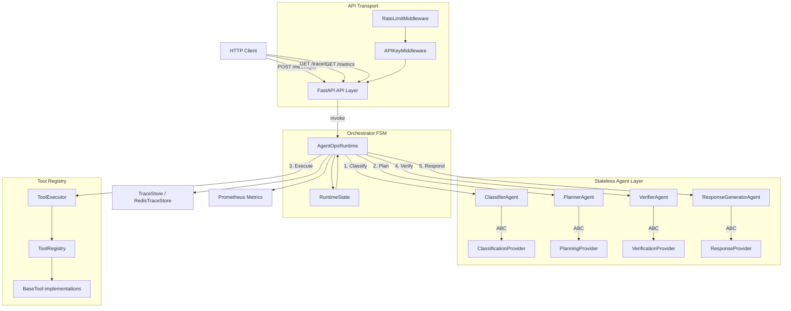

# AgentOps

Production-grade AI customer operations platform. Structured task routing through a finite state machine runtime — classify, plan, execute tools, verify, respond.

[](https://github.com/s7g4/AgentOps/actions/workflows/ci.yml)
[](https://www.python.org/downloads/release/python-3120/)
[](LICENSE)

---

## Architecture



---

## Quickstart

**Requirements**: Python 3.12+, Docker (optional)

```bash
git clone https://github.com/s7g4/AgentOps.git
cd AgentOps
python -m venv .venv && source .venv/bin/activate
pip install -e ".[dev]"
python -m app.main
```

API available at `http://localhost:8000`.

### Docker

```bash
docker compose up
```

---

## Configuration

| Variable | Default | Description |
|---|---|---|
| `HOST` | `0.0.0.0` | Bind address |
| `PORT` | `8000` | Listen port |
| `LOG_LEVEL` | `INFO` | `DEBUG` / `INFO` / `WARNING` / `ERROR` |
| `OPENAI_API_KEY` | — | Required for LLM-backed providers |
| `REDIS_URL` | — | Enables Redis-backed trace persistence |
| `TRACE_BACKEND` | `memory` | `memory` or `redis` |
| `AUTH_ENABLED` | `false` | Enable API key header validation |
| `API_KEY` | — | Required when `AUTH_ENABLED=true` |

---

## API

### `POST /messages`

```json
// Request
{ "source": "ticket", "customer_id": "cust_123", "message": "I want a refund" }

// Response
{ "trace_id": "550e8400-...", "intent": "refund", "confidence": 0.8, "escalated": false, "response": "..." }
```

### `POST /messages/batch`
Concurrent batch processing of multiple message payloads.

### `GET /trace/{trace_id}`
Full execution timeline — state transitions, tool calls, agent decisions.

### `GET /trace/`
Paginated trace listing. Query params: `limit` (default 20), `offset` (default 0).

### `GET /metrics`
Prometheus exposition format. Scraped at `/metrics`.

### `GET /health`
Liveness and dependency readiness probe. Returns `status`, `redis`, `openai_key`.

### `GET /tools`
Registered tool names and input schemas.

### `POST /evaluation`
Runs the evaluation harness on synthetic ticket data. Returns accuracy, latency, and escalation rate.

---

## Observability

### Prometheus Metrics

| Metric | Type | Labels |
|---|---|---|
| `agentops_requests_total` | Counter | `route`, `status` |
| `agentops_request_latency_seconds` | Histogram | `route` |
| `agentops_tool_execution_total` | Counter | `tool_name`, `status` |
| `agentops_tool_execution_latency_seconds` | Histogram | `tool_name` |
| `agentops_verifier_escalations_total` | Counter | — |

### Structured Logging

Every log line is a flat JSON object with `trace_id` injected automatically via `contextvars.ContextVar`:

```json
{
  "timestamp": "2026-07-03T10:00:00.000Z",
  "level": "info",
  "event": "request_received",
  "trace_id": "550e8400-e29b-41d4-...",
  "customer_id": "cust_123"
}
```

---

## Testing

```bash
pytest -q                                       # full suite
pytest --cov=app --cov-report=term-missing      # with coverage
ruff check .                                    # lint
mypy app                                        # type check
```

---

## Design Notes

- **Provider abstraction** — agents depend on ABCs, not concrete implementations. Swap `DeterministicClassifierProvider` for `OpenAIClassificationProvider` at the injection site, nothing else changes.
- **FSM enforcement** — `VALID_TRANSITIONS` in `state_machine.py` declares all legal state moves. Illegal transitions raise `InvalidTransitionError` immediately.
- **Structured exceptions** — `AgentOpsError` hierarchy maps error types to HTTP status codes in middleware, not in handlers.
- **Trace storage** — `InMemoryTraceStore` (default, LRU-capped at 10,000) or `RedisTraceStore` (set `TRACE_BACKEND=redis`). Both implement the same `TraceStore` protocol.
- **Retry logic** — tool execution uses `tenacity` with exponential backoff. Configurable per-tool.
